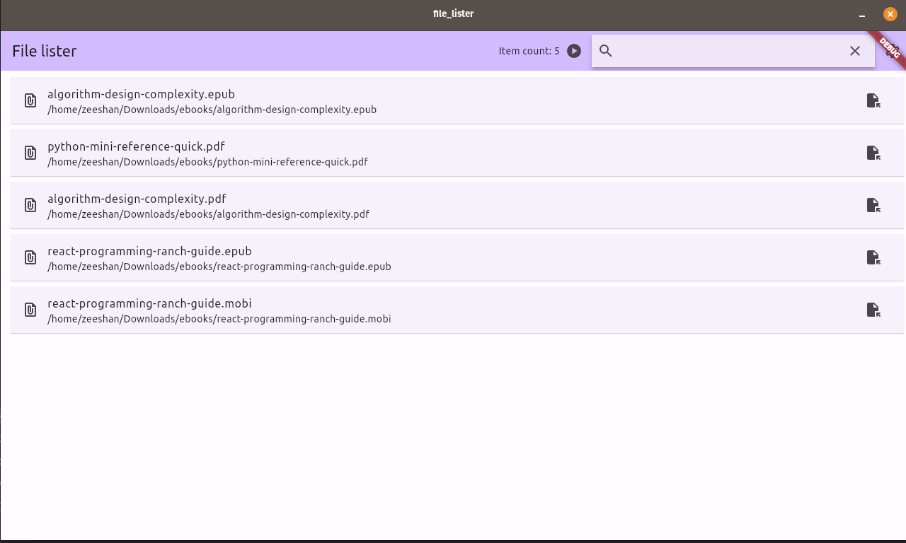
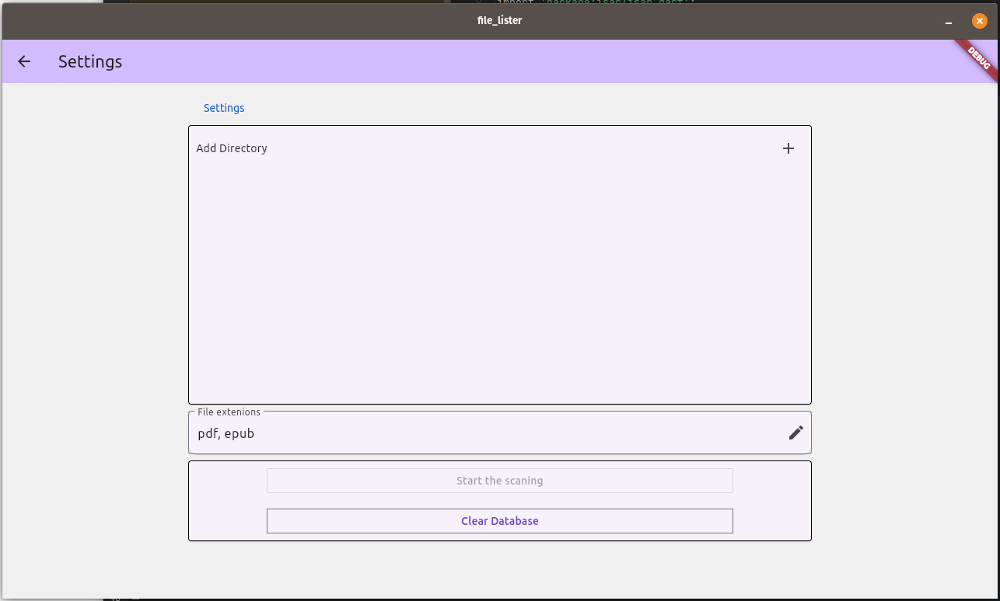

# file lister

flutter desktop app which scan the file directoies and record the file with extsion listed

## Getting Started

## build app for linux, windows or macos 
 run `flutter build linux`  
 should generate binary or exe for platform 

 
## screenshots 

   
   

